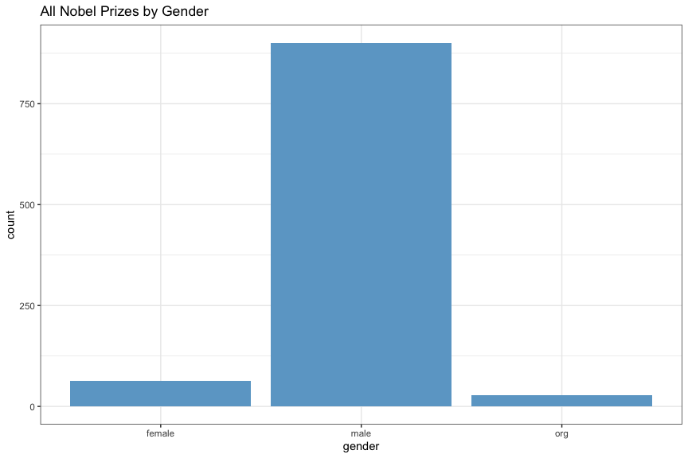
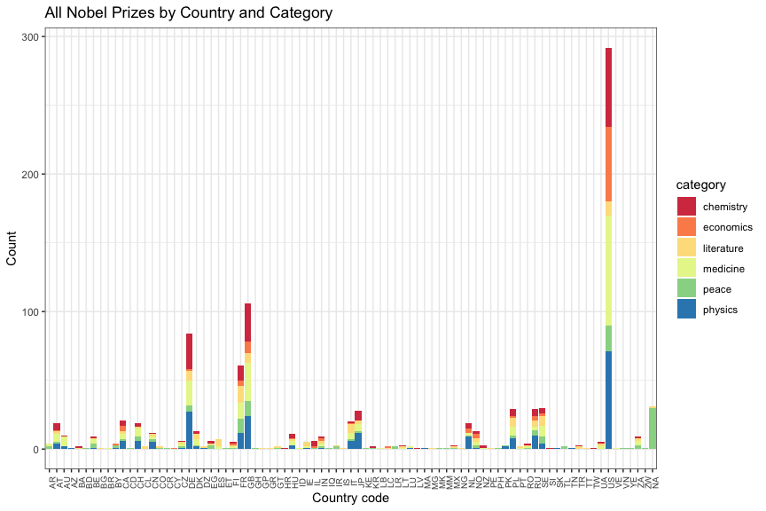

Analysis of Nobel Prize Data
================
Neil Saunders
compiled 2018-03-15 22:13:03

# Introduction

This document illustrates some ways to analyse data from the Nobel Prize
API using the R programming language.

# Getting the data

We use the [Nobel Prize API](https://nobelprize.readme.io/) to fetch
laureate data in JSON format.

``` r
library(ggplot2)
library(jsonlite)
library(plyr)
library(dplyr)
library(networkD3)
library(xtable)
setwd("~/Dropbox/projects/code/R")
```

``` r
u <- "http://api.nobelprize.org/v1/laureate.json"
nobel <- fromJSON(u)

names(nobel)
```

    ## [1] "laureates"

``` r
names(nobel$laureates)
```

    ##  [1] "id"              "firstname"       "surname"        
    ##  [4] "born"            "died"            "bornCountry"    
    ##  [7] "bornCountryCode" "bornCity"        "diedCountry"    
    ## [10] "diedCountryCode" "diedCity"        "gender"         
    ## [13] "prizes"

``` r
names(nobel$laureates$prizes[[1]])
```

    ## [1] "year"         "category"     "share"        "motivation"  
    ## [5] "affiliations"

The variable *nobel* is a list with one named element, *laureates*. The
variable *laureates* is a data frame with 13 columns, one row per
laureate. The last column, *prizes* is a list of data frames.

Note that analyses that use *prizes* may count some laureates twice.
However, there are only four such individuals, which makes little
difference to these charts.

# Analysis

## Multiple prize winners

We can retrieve those laureates who won more than one prize by selecting
records where *nobel$laureates$prizes* has more than one row.

``` r
multi <- which(sapply(nobel$laureates$prizes, function(x) nrow(x)) > 1)
winners <- nobel$laureates[multi, c("firstname", "surname", "born", "bornCountry")]
print(xtable(winners), type = "html", comment = FALSE, include.rownames = FALSE)
```

<table border="1">

<tr>

<th>

firstname

</th>

<th>

surname

</th>

<th>

born

</th>

<th>

bornCountry

</th>

</tr>

<tr>

<td>

Marie

</td>

<td>

Curie, née Sklodowska

</td>

<td>

1867-11-07

</td>

<td>

Russian Empire (now Poland)

</td>

</tr>

<tr>

<td>

John

</td>

<td>

Bardeen

</td>

<td>

1908-05-23

</td>

<td>

USA

</td>

</tr>

<tr>

<td>

Linus Carl

</td>

<td>

Pauling

</td>

<td>

1901-02-28

</td>

<td>

USA

</td>

</tr>

<tr>

<td>

Frederick

</td>

<td>

Sanger

</td>

<td>

1918-08-13

</td>

<td>

United Kingdom

</td>

</tr>

<tr>

<td>

Comité international de la Croix Rouge (International Committee of the
Red Cross)

</td>

<td>

</td>

<td>

0000-00-00

</td>

<td>

</td>

</tr>

<tr>

<td>

Office of the United Nations High Commissioner for Refugees (UNHCR)

</td>

<td>

</td>

<td>

0000-00-00

</td>

<td>

</td>

</tr>

</table>

Four individuals have won two prizes: Marie Curie (physics, chemistry);
John Bardeen (physics); Linus Pauling (chemistry, peace); Frederick
Sanger (chemistry).

## Gender

Counting up prizes by gender reveals the huge gender gap in Nobel
laureates.

``` r
gender <- as.data.frame(table(nobel$laureates$gender), stringsAsFactors = FALSE)
ggplot(gender) + geom_bar(aes(Var1, Freq), stat = "identity", fill = "skyblue3") + 
    theme_bw() + labs(x = "gender", y = "count", title = "All Nobel Prizes by Gender")
```

<!-- -->

### Gender by category

``` r
cnt <- sapply(nobel$laureates$prizes, function(x) nrow(x))
prizes <- ldply(nobel$laureates$prizes, as.data.frame)
prizes$id <- rep(nobel$laureates$id, cnt)
prizes$gender <- rep(nobel$laureates$gender, cnt)
pg <- as.data.frame(table(prizes$category, prizes$gender), stringsAsFactors = FALSE)
ggplot(pg, aes(Var2, Freq)) + geom_bar(aes(fill = Var2), stat = "identity") + 
    theme_bw() + facet_grid(. ~ Var1) + labs(x = "gender", y = "count", title = "All Nobel Prizes by Gender and Category") + 
    scale_fill_manual(values = c("darkorange", "skyblue3", "grey"), name = NULL) + 
    theme(axis.text.x = element_blank())
```

<!-- -->

### Gender over time

Is there any indication of an increase in female laureates over
time?

``` r
p5 <- as.data.frame(table(prizes$year, prizes$gender), stringsAsFactors = FALSE)
colnames(p5) <- c("year", "gender", "Freq")
p5.1 <- mutate(group_by(p5, gender), cumsum = cumsum(Freq))
ggplot(subset(p5.1, gender != "org")) + geom_point(aes(year, log(cumsum), color = gender)) + 
    theme_bw() + scale_x_discrete(breaks = seq(1900, 2015, 10)) + scale_color_manual(values = c("darkorange", 
    "skyblue3")) + labs(x = "year", y = "log(cumulative sum) of laureates", 
    title = "Cumulative Sum of Nobel Laureates by Gender over Time")
```

<!-- -->

There is some indication that since about 1975, more women have won
prizes than in the preceding years. What if we subset by
category?

``` r
p6 <- as.data.frame(table(prizes$year, prizes$category, prizes$gender), stringsAsFactors = FALSE)
colnames(p6) <- c("year", "category", "gender", "Freq")
p6.1 <- mutate(group_by(p6, category, gender), cumsum = cumsum(Freq))
ggplot(subset(p6.1, gender != "org")) + geom_point(aes(year, log(cumsum), color = gender)) + 
    facet_grid(category ~ .) + theme_bw() + scale_x_discrete(breaks = seq(1900, 
    2015, 10)) + scale_color_manual(values = c("darkorange", "skyblue3")) + 
    labs(x = "year", y = "log(cumulative sum) of laureates", title = "Cumulative Sum of Nobel Laureates by Gender and Category over Time")
```

<!-- -->

There is some indication that since about 1975, more women have won
prizes in medicine and peace than in the preceding years. The rate of
awards to women for literature also rises after about 1990.

To date, only one woman has won the prize for economics, two women have
won for physics and four have won for chemistry.

## Share

Prizes may be shared by no more than three people. How often has this
occurred?

``` r
share <- as.data.frame(table(prizes$year, prizes$category), stringsAsFactors = FALSE)
colnames(share) <- c("year", "category", "Freq")
share1 <- as.data.frame(table(share$Freq), stringsAsFactors = FALSE)
ggplot(share1[share1$Var1 != 0, ]) + geom_bar(aes(Var1, Freq), stat = "identity", 
    fill = "skyblue3") + theme_bw() + labs(x = "number of laureates", y = "count", 
    title = "Laureates per Nobel Prize")
```

<!-- -->

Individual winners are most common.

### Share by category

Are there any notable differences in prize sharing between
fields?

``` r
share2 <- as.data.frame(table(share$category, share$Freq), stringsAsFactors = FALSE)
colnames(share2) <- c("category", "share", "Freq")
ggplot(subset(share2, share > 0)) + geom_bar(aes(share, Freq), stat = "identity", 
    fill = "skyblue3") + theme_bw() + facet_grid(. ~ category) + labs(x = "share", 
    y = "count", title = "Laureates per Nobel Prize by Category")
```

<!-- -->

Individual winners are more common in all categories, notably literature
and peace. In the sciences, two or three winners are roughly equally
common; chemistry stands out with more individual winners than medicine
or physics.

## Ages

How old are the laureates? The data does not include the date that
prizes were awarded so for those cases where birth date is available, we
calculate age at the end of the year in which laureates won their prize.
Median age is indicated by a point in this plot.

### Ages by category

``` r
prizes$born <- rep(nobel$laureates$born, cnt)
prizes$age <- as.Date(paste(prizes$year, "12-31", sep = "-"), "%Y-%m-%d") - as.Date(prizes$born, "%Y-%m-%d")
ggplot(prizes[!is.na(prizes$category), ]) + geom_violin(aes(category, as.numeric(age) / 365), fill = "skyblue3") + theme_bw() + stat_summary(aes(category, as.numeric(age) / 365), fun.y = "median", geom = "point") + labs(x = "category", y = "age (years)", title = "Age Distribution of Nobel Laureates by Category")
```

<!-- -->

Median age is over 50 for all categories; physics laureates have the
youngest median and economics the oldest. The peace prize is skewed by a
recent very young “outlier”.

### Ages by year awarded

Is there a change in age at which prizes were awarded over
time?

``` r
ggplot(prizes[!is.na(prizes$category), ]) + geom_point(aes(year, as.numeric(age)/365)) + 
    theme_bw() + geom_smooth(aes(year, as.numeric(age)/365, group = 1)) + facet_wrap(~category) + 
    scale_x_discrete(breaks = seq(1900, 2015, 25)) + labs(x = "year", y = "age(years) at end of year", 
    title = "Age of Nobel Laureates Over Time by Category")
```

<!-- -->

There is a downward trend in age for the peace prize, again somewhat
skewed by a young outlier. All other categories show an upward trend in
age. This is especially pronounced for physics and chemistry, where
laureates were much younger in the early part of the 20th century.

## Countries

### Countries by category

It is possible to calculate the number of prizes awarded by country of
birth, but do the absolute numbers really tell us anything? Clearly
there should be some kind of correction as larger, wealthier countries
might be expected to produce more laureates. However, this is not
straightforward - what correction should be applied? Using current
population, for example, might generate a bias towards very small
countries with only one or two laureates. In addition, the
characteristics of countries (population, GDP, borders) change over
time.

We will therefore simply present the absolute numbers and let readers
draw their own conclusions regarding the “success” of individual
countries. This chart uses [ISO 3166 2-letter country
codes](https://en.wikipedia.org/wiki/ISO_3166-1_alpha-2).

``` r
# data(iso3166)
prizes$country <- rep(nobel$laureates$bornCountryCode, cnt)
p3 <- as.data.frame(table(prizes$category, prizes$country), stringsAsFactors = FALSE)
ggplot(p3) + geom_bar(aes(Var2, Freq, fill = Var1), stat = "identity", position = "stack") + 
    theme_bw() + theme(axis.text.x = element_text(angle = 90, size = rel(0.82))) + 
    labs(x = "country code", y = "count", title = "All Nobel Prizes by Country and Category") + 
    scale_fill_manual(values = c("#ffffcc", "#c7e9b4", "#7fcdbb", "#41b6c4", 
        "#2c7fb8", "#253494"), name = "category")
```

<!-- -->

### Country of birth and death

We can select records where laureates died in a different country to
that of their birth and try to visualize migration. This code generates
a Sankey diagram using the D3
library.

``` r
country <- as.data.frame(table(nobel$laureates$bornCountryCode, nobel$laureates$diedCountryCode), 
    stringsAsFactors = FALSE)
c1 <- subset(country, Freq > 0 & Var1 != Var2)
c2 <- data.frame(nodes = unique(c(nobel$laureates$bornCountryCode, nobel$laureates$diedCountryCode)))
c2 <- na.omit(c2)

m1 <- match(c1$Var1, c2$nodes)
m2 <- match(c1$Var2, c2$nodes)
c1$Var1 <- m1 - 1
c1$Var2 <- m2 - 1
sn <- sankeyNetwork(Links = c1, Nodes = c2, Source = "Var1", Target = "Var2", 
    Value = "Freq", fontSize = 12, nodeWidth = 30)
```

Here is the result (interactive: try hovering over it).

<!-- -->

The migration of many laureates to the US is apparent, as is the number
of laureates originating from or moving to European nations such as the
UK, France, Germany and Poland.
