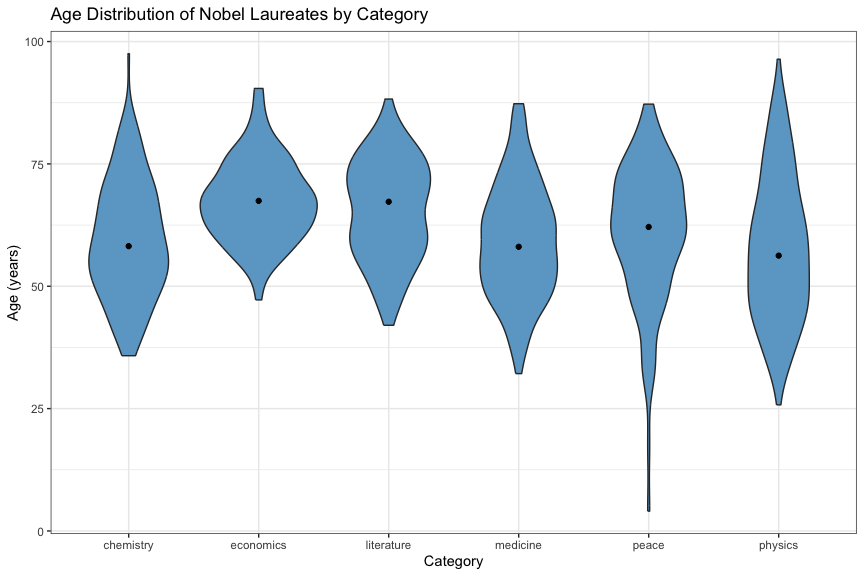

Analysis of Nobel Prize Data
================
Neil Saunders
compiled 2023-01-22 10:53:49

- <a href="#introduction" id="toc-introduction">Introduction</a>
- <a href="#getting-the-data" id="toc-getting-the-data">Getting the
  data</a>
- <a href="#analysis" id="toc-analysis">Analysis</a>
  - <a href="#multiple-prize-winners"
    id="toc-multiple-prize-winners">Multiple prize winners</a>
  - <a href="#gender" id="toc-gender">Gender</a>
    - <a href="#gender-by-category" id="toc-gender-by-category">Gender by
      category</a>
    - <a href="#gender-over-time" id="toc-gender-over-time">Gender over
      time</a>
  - <a href="#share" id="toc-share">Share</a>
    - <a href="#share-by-category" id="toc-share-by-category">Share by
      category</a>
  - <a href="#ages" id="toc-ages">Ages</a>
    - <a href="#ages-by-category" id="toc-ages-by-category">Ages by
      category</a>
    - <a href="#ages-by-year-awarded" id="toc-ages-by-year-awarded">Ages by
      year awarded</a>
  - <a href="#countries" id="toc-countries">Countries</a>
    - <a href="#countries-by-category"
      id="toc-countries-by-category">Countries by category</a>
    - <a href="#country-of-birth-and-death"
      id="toc-country-of-birth-and-death">Country of birth and death</a>

# Introduction

This document illustrates some ways to analyse data from the Nobel Prize
API using the R programming language.

# Getting the data

We use the [Nobel Prize API](https://nobelprize.readme.io/) to fetch
laureate data in JSON format.

    ## [1] "laureates"

    ##  [1] "id"              "firstname"       "surname"         "born"           
    ##  [5] "died"            "bornCountry"     "bornCountryCode" "bornCity"       
    ##  [9] "diedCountry"     "diedCountryCode" "diedCity"        "gender"         
    ## [13] "prizes"

    ## [1] "year"         "category"     "share"        "motivation"   "affiliations"

The variable *nobel* is a list with one named element, *laureates*. The
variable *laureates* is a data frame with 13 columns, one row per
laureate. The last column, *prizes* is a list of data frames.

# Analysis

## Multiple prize winners

We can retrieve those laureates who won more than one prize by selecting
records where *nobel\$laureates\$prizes* has more than one row.

<table class="table table-striped" style="margin-left: auto; margin-right: auto;">
<caption>
Multiple winners
</caption>
<thead>
<tr>
<th style="text-align:left;">
firstname
</th>
<th style="text-align:left;">
surname
</th>
<th style="text-align:left;">
born
</th>
<th style="text-align:left;">
bornCountry
</th>
<th style="text-align:left;">
year
</th>
<th style="text-align:left;">
category
</th>
</tr>
</thead>
<tbody>
<tr>
<td style="text-align:left;">
Marie
</td>
<td style="text-align:left;">
Curie
</td>
<td style="text-align:left;">
1867-11-07
</td>
<td style="text-align:left;">
Russian Empire (now Poland)
</td>
<td style="text-align:left;">
1903
</td>
<td style="text-align:left;">
physics
</td>
</tr>
<tr>
<td style="text-align:left;">
Marie
</td>
<td style="text-align:left;">
Curie
</td>
<td style="text-align:left;">
1867-11-07
</td>
<td style="text-align:left;">
Russian Empire (now Poland)
</td>
<td style="text-align:left;">
1911
</td>
<td style="text-align:left;">
chemistry
</td>
</tr>
<tr>
<td style="text-align:left;">
John
</td>
<td style="text-align:left;">
Bardeen
</td>
<td style="text-align:left;">
1908-05-23
</td>
<td style="text-align:left;">
USA
</td>
<td style="text-align:left;">
1956
</td>
<td style="text-align:left;">
physics
</td>
</tr>
<tr>
<td style="text-align:left;">
John
</td>
<td style="text-align:left;">
Bardeen
</td>
<td style="text-align:left;">
1908-05-23
</td>
<td style="text-align:left;">
USA
</td>
<td style="text-align:left;">
1972
</td>
<td style="text-align:left;">
physics
</td>
</tr>
<tr>
<td style="text-align:left;">
Linus
</td>
<td style="text-align:left;">
Pauling
</td>
<td style="text-align:left;">
1901-02-28
</td>
<td style="text-align:left;">
USA
</td>
<td style="text-align:left;">
1962
</td>
<td style="text-align:left;">
peace
</td>
</tr>
<tr>
<td style="text-align:left;">
Linus
</td>
<td style="text-align:left;">
Pauling
</td>
<td style="text-align:left;">
1901-02-28
</td>
<td style="text-align:left;">
USA
</td>
<td style="text-align:left;">
1954
</td>
<td style="text-align:left;">
chemistry
</td>
</tr>
<tr>
<td style="text-align:left;">
Frederick
</td>
<td style="text-align:left;">
Sanger
</td>
<td style="text-align:left;">
1918-08-13
</td>
<td style="text-align:left;">
United Kingdom
</td>
<td style="text-align:left;">
1958
</td>
<td style="text-align:left;">
chemistry
</td>
</tr>
<tr>
<td style="text-align:left;">
Frederick
</td>
<td style="text-align:left;">
Sanger
</td>
<td style="text-align:left;">
1918-08-13
</td>
<td style="text-align:left;">
United Kingdom
</td>
<td style="text-align:left;">
1980
</td>
<td style="text-align:left;">
chemistry
</td>
</tr>
<tr>
<td style="text-align:left;">
International Committee of the Red Cross
</td>
<td style="text-align:left;">
NA
</td>
<td style="text-align:left;">
1863-00-00
</td>
<td style="text-align:left;">
NA
</td>
<td style="text-align:left;">
1917
</td>
<td style="text-align:left;">
peace
</td>
</tr>
<tr>
<td style="text-align:left;">
International Committee of the Red Cross
</td>
<td style="text-align:left;">
NA
</td>
<td style="text-align:left;">
1863-00-00
</td>
<td style="text-align:left;">
NA
</td>
<td style="text-align:left;">
1944
</td>
<td style="text-align:left;">
peace
</td>
</tr>
<tr>
<td style="text-align:left;">
International Committee of the Red Cross
</td>
<td style="text-align:left;">
NA
</td>
<td style="text-align:left;">
1863-00-00
</td>
<td style="text-align:left;">
NA
</td>
<td style="text-align:left;">
1963
</td>
<td style="text-align:left;">
peace
</td>
</tr>
<tr>
<td style="text-align:left;">
Office of the United Nations High Commissioner for Refugees
</td>
<td style="text-align:left;">
NA
</td>
<td style="text-align:left;">
1950-12-14
</td>
<td style="text-align:left;">
NA
</td>
<td style="text-align:left;">
1954
</td>
<td style="text-align:left;">
peace
</td>
</tr>
<tr>
<td style="text-align:left;">
Office of the United Nations High Commissioner for Refugees
</td>
<td style="text-align:left;">
NA
</td>
<td style="text-align:left;">
1950-12-14
</td>
<td style="text-align:left;">
NA
</td>
<td style="text-align:left;">
1981
</td>
<td style="text-align:left;">
peace
</td>
</tr>
<tr>
<td style="text-align:left;">
Barry
</td>
<td style="text-align:left;">
Sharpless
</td>
<td style="text-align:left;">
1941-04-28
</td>
<td style="text-align:left;">
USA
</td>
<td style="text-align:left;">
2001
</td>
<td style="text-align:left;">
chemistry
</td>
</tr>
<tr>
<td style="text-align:left;">
Barry
</td>
<td style="text-align:left;">
Sharpless
</td>
<td style="text-align:left;">
1941-04-28
</td>
<td style="text-align:left;">
USA
</td>
<td style="text-align:left;">
2022
</td>
<td style="text-align:left;">
chemistry
</td>
</tr>
</tbody>
</table>

## Gender

Counting up prizes by gender reveals the huge gender gap in Nobel
laureates.

<!-- -->

### Gender by category

<!-- -->

### Gender over time

Is there any indication of an increase in female laureates over time?

<!-- -->

There is some indication that since about 1975, more women have won
prizes than in the preceding years. What if we subset by category?

<!-- -->

There is some indication that since about 1975, more women have won
prizes in medicine and peace than in the preceding years. The rate of
awards to women for literature also rises after about 1990.

## Share

Prizes may be shared by no more than three people. How often has this
occurred?

<!-- -->

Individual winners are most common.

### Share by category

Are there any notable differences in prize sharing between fields?

<!-- -->

Individual winners are more common in all categories, notably literature
and peace.

In the sciences, two or three winners are roughly equally common;
chemistry stands out with more individual winners than medicine or
physics.

## Ages

How old are the laureates? The data does not include the date that
prizes were awarded so for those cases where birth date is available, we
calculate age at the end of the year in which laureates won their prize.
Median age is indicated by a point in this plot.

### Ages by category

<!-- -->

Median age is over 50 for all categories; physics laureates have the
youngest median and economics the oldest.

The peace prize is skewed by a recent very young “outlier”.

### Ages by year awarded

Is there a change in age at which prizes were awarded over time?

<!-- -->

There is a downward trend in age for the peace prize, again somewhat
skewed by a young outlier. All other categories show an upward trend in
age.

This is especially pronounced for physics and chemistry, where laureates
were much younger in the early part of the 20th century.

## Countries

### Countries by category

It is possible to calculate the number of prizes awarded by country of
birth, but do the absolute numbers really tell us anything? Clearly
there should be some kind of correction as larger, wealthier countries
might be expected to produce more laureates. However, this is not
straightforward - what correction should be applied? Using current
population, for example, might generate a bias towards very small
countries with only one or two laureates. In addition, the
characteristics of countries (population, GDP, borders) change over
time.

We will therefore simply present the absolute numbers and let readers
draw their own conclusions regarding the “success” of individual
countries. This chart uses [ISO 3166 2-letter country
codes](https://en.wikipedia.org/wiki/ISO_3166-1_alpha-2).

<!-- -->

### Country of birth and death

We can select records where laureates died in a different country to
that of their birth and try to visualize migration. This code generates
a Sankey diagram using the D3 library.

Here is the result.

The migration of many laureates to the US is apparent, as is the number
of laureates originating from or moving to European nations such as the
UK, France, Germany and Poland.
